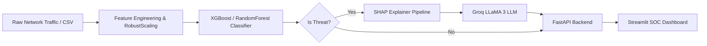

# 🛡️ Aegis: AI Security Intelligence Platform

> An enterprise-grade, end-to-end AI-powered Intrusion Detection System (IDS) combining Machine Learning (XGBoost/RandomForest) with LLM-based Cyber Threat Intelligence (Groq LLaMA 3).

---

## 🚀 Overview

The **Aegis AI Security Intelligence Platform** is a full-stack cybersecurity application built to mimic a modern Security Operations Center (SOC). It goes beyond traditional binary classification by offering:

- **Detection**: Identifies malicious network traffic anomalies with high accuracy.
- **Explainability**: Uses SHAP (SHapley Additive exPlanations) to explain *why* a flow was flagged, highlighting the exact network parameters (e.g., specific byte loads, packet rates).
- **Contextual Intelligence**: Feeds SHAP metrics and raw feature data natively into Groq's LLaMA 3 model to generate human-readable, factual threat intelligence reports for Tier-1 analysts.
- **Batch Processing**: Allows security engineers to upload large CSV packet captures/flow schemas for bulk threat hunting.
- **Data Analytics Hub**: Extracts macro-level descriptive and diagnostic analytics (Dataset Profiling, Attack Trend Analysis, Feature Correlation Heatmaps, and Statistical Outlier Detection).
- **Automated Business Insights**: Dynamically generates business-focused intelligence reports from batch aggregations using Groq LLaMA 3.
- **Experiment Tracking**: Natively tracks model versions, parameters, and evaluations using MLflow logs.

---

## 🧠 System Architecture



---

## 🏗️ Tech Stack

### 🔹 Machine Learning Pipeline
- **Algorithms**: XGBoost Classifiers, Random Forest
- **Libraries**: Scikit-learn, Pandas, NumPy, SHAP
- **Tracking**: MLflow JSON tracking
- **Dataset**: UNSW-NB15 Dataset

### 🔹 AI Reasoning
- **LLM Engine**: Groq API
- **Model**: LLaMA 3.1
- **Technique**: Context-injected Prompt Engineering

### 🔹 Data Analytics & Visualization
- **EDA & Profiling**: Pandas, NumPy
- **Heatmaps & Outliers**: Seaborn, SciPy (IQR Method)
- **Interactive Dashboards**: Plotly Express

### 🔹 Backend & APIs
- **Framework**: FastAPI (Uvicorn)
- **Validation**: Pydantic Schema Validation
- **Architecture**: RESTful Microservices

### 🔹 Frontend & Deployment
- **Dashboard**: Streamlit (Dark Theme Custom CSS)
- **Infrastructure**: Docker, Docker Compose
- **Testing**: Pytest

---

## ⚙️ Installation & Setup (Dockerized)

The easiest and recommended way to run the application is via Docker Compose to ensure all environment dependencies and networking rules are mapped correctly.

### 1️⃣ Clone Repository
```bash
git clone https://github.com/yourusername/ai-security-intelligence-platform.git
cd ai-security-intelligence-platform
```

### 2️⃣ Configure Environment Variables
Create a `.env` file in the root directory:
```bash
# Required for Threat Intelligence LLM insights
GROQ_API_KEY=your_groq_api_key_here
```
*(Never commit your `.env` to version control!)*

### 3️⃣ Launch with Docker Compose
```bash
docker compose up --build -d
```
This command will quietly build both the backend API and the frontend SOC dashboard, attach the necessary volumes for logs, and expose the ports to your local host.

---

## ▶️ Usage & Endpoints

Once Docker finishes building and the services are healthy, you can access:

### 🛡️ SOC Streamlit Dashboard
Navigate to your browser:
**[http://localhost:8501](http://localhost:8501)**

The dashboard features four main tabs:
1. **Single Analyst View**: For manual triage of specific network flows.
2. **Batch Threat Hunting**: Upload `CSV` network files for bulk evaluation.
3. **Model Intelligence**: View local MLflow tracked experiments, hyperparameter values, and performance metrics (Accuracy, F1, ROC-AUC, FPR).
4. **Data & Analytics Hub**: An advanced workspace containing interactive Plotly visualiztions for traffic intelligence, seaborn feature correlations, dataset health matrices, and GenAI business insights.

### ⚙️ FastAPI Swagger UI
Navigate to your browser:
**[http://localhost:8000/docs](http://localhost:8000/docs)**

| Method | Endpoint | Description |
|--------|----------|------------|
| `GET`    | `/`        | Health check |
| `POST`   | `/predict` | Raw binary prediction logic |
| `POST`   | `/analyze` | Full ML Inference + SHAP Evaluation + LLM Generation |
| `POST`   | `/analyze-csv`| Accepts `.csv` file uploads for bulk threat predictions |
| `POST`   | `/analytics/batch-profile`| Full Data Profiling, IQR Outlier Detection, Correlation Matrices, ML Inference + Batch LLM Insight Generation |

---

## 📦 Project Structure

```text
AI-Security-Platform/
│
├── api/                  # FastAPI backend + Groq integration
│   ├── analytics/        # (NEW) Pandas/Plotly Statistical Modules + Business Insight Generators
├── configs/              # TBD Configuration settings
├── dashboard/            # Streamlit frontend SOC interface
├── data/                 # Raw UNSW parquet files
├── inference/            # Model loading & SHAP explanation logic
├── mlflow_tracking/      # Offline JSON experiment logs mapped via Docker volume
├── models/               # pre-compiled XGBoost pipeline (.pkl)
├── tests/                # Pytest endpoints
├── training/             # Feature Engineering, ML pipelines, Evaluation logic
│
├── docker-compose.yml
├── Dockerfile.backend
├── Dockerfile.dashboard
├── .dockerignore
└── requirements.txt
```

---

## � Local Model Re-Training (Without Docker)
If you wish to experiment with hyperparameters or add new algorithms:
1. Create a `venv` and `pip install -r requirements.txt`.
2. Run `python training/train_pipeline.py`.
3. The script will automatically parse the datasets, train the models iteratively, and save the model with the highest `F1-Score` to the `models/` folder, replacing the older version.

---

## 👨‍💻 Author
**Yash Sinha**  
*AI / ML & Systems Engineering Enthusiast*

---
## 📜 License
MIT License
